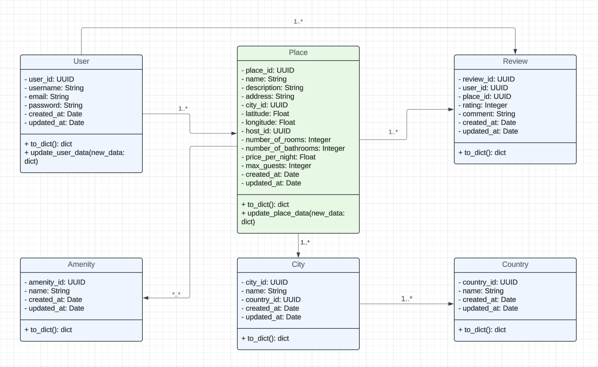

# HBnB Evolution

HBnB Evolution is a web application inspired by AirBnB, developed in Python with Flask. This application allows for the management of users, places, reviews, amenities, cities, and countries.

## Project Structure

- **api/** : Contains the routes and controllers for the different models.
- **model/** : Contains the data models representing the entities.
- **persistence/** : Contains the persistence classes for managing CRUD operations.
- **data_manager.py** : Manages CRUD operations across different entity types.
- **Dockerfile** : For containerizing the application with Docker.
- **requirements.txt** : List of Python dependencies.

## Models

- **User** : Represents a user of the application.
- **Place** : Represents a place available for rent.
- **Review** : Represents a review of a place.
- **Amenity** : Represents an amenity available in a place.
- **City** : Represents a city where places are located.
- **Country** : Represents a country that contains cities.

## Endpoints

### User

- **POST /users** : Create a new user.
- **GET /users** : Retrieve all users.
- **GET /users/{user_id}** : Retrieve a user by their ID.
- **PUT /users/{user_id}** : Update an existing user.
- **DELETE /users/{user_id}** : Delete a user.

### Place

- **POST /places** : Create a new place.
- **GET /places** : Retrieve all places.
- **GET /places/{place_id}** : Retrieve a place by its ID.
- **PUT /places/{place_id}** : Update an existing place.
- **DELETE /places/{place_id}** : Delete a place.

### Review

- **POST /places/{place_id}/reviews** : Create a new review for a place.
- **GET /users/{user_id}/reviews** : Retrieve all reviews written by a user.
- **GET /places/{place_id}/reviews** : Retrieve all reviews for a place.
- **GET /reviews/{review_id}** : Retrieve a review by its ID.
- **PUT /reviews/{review_id}** : Update an existing review.
- **DELETE /reviews/{review_id}** : Delete a review.

### Amenity

- **POST /amenities** : Create a new amenity.
- **GET /amenities** : Retrieve all amenities.
- **GET /amenities/{amenity_id}** : Retrieve an amenity by its ID.
- **PUT /amenities/{amenity_id}** : Update an existing amenity.
- **DELETE /amenities/{amenity_id}** : Delete an amenity.

### City

- **POST /cities** : Create a new city.
- **GET /cities** : Retrieve all cities.
- **GET /cities/{city_id}** : Retrieve a city by its ID.
- **PUT /cities/{city_id}** : Update an existing city.
- **DELETE /cities/{city_id}** : Delete a city.

### Country

- **GET /countries** : Retrieve all countries.
- **GET /countries/{country_code}** : Retrieve a country by its code.
- **GET /countries/{country_code}/cities** : Retrieve all cities in a country.

## Docker

To containerize the application with Docker:

1. Build the Docker image:
    ```bash
    docker build -t hbnb-evolution .
    ```

2. Run the Docker container:
    ```
    docker run -d -p 8001:8000 -v $(pwd)/data:/app/data --name my-flask-container -e PORT=8000 hbnb-evolution
    ```
3. Click on this link :

    ## [Best Hbnb site in the world !!](http://localhost:8001/)

## Tests

To run the unit tests, use the following command:

```
    python3 -m unittest discover -s tests
```

Make sure all tests pass before deploying or modifying the code.

## UML Diagram



## Authors

- [Nicolas Brault Domingo](https://github.com/Ho2bes/)
- [Francia Ramarolahy](https://github.com/Francianeny/)
- [Tifenn Guérin](https://github.com/GuerinTifenn/)

---
This project is developed as part of the Holberton School curriculum. For more information, please visit [Holberton School](https://www.holbertonschool.com).
